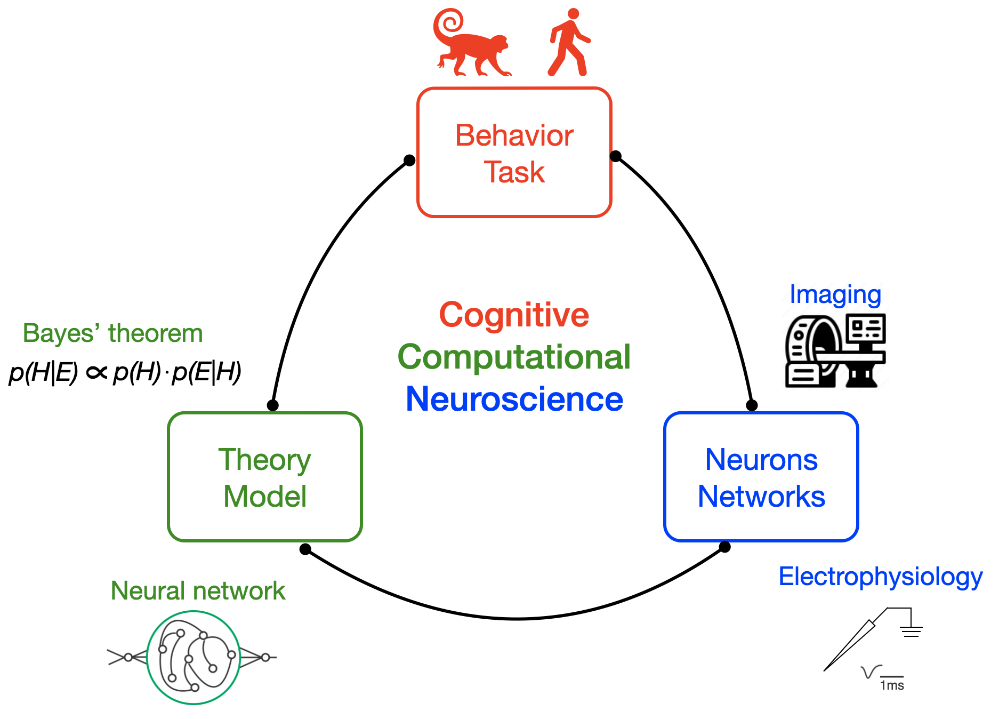
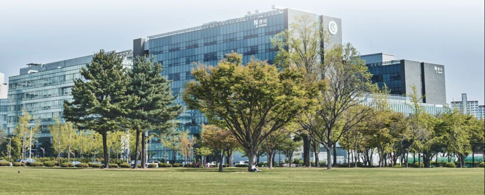

## Vision statement

We aim to solve the mystery of how the brain generates complex and intelligent behaviors. To this end, we carefully design behavioral tasks, measure neural activities at multiple scales, and analyze data using computational models and theories. These efforts are driven by curiosity and a passion for science, a strong work ethic, independence, optimism, constructive criticism, diversity, and teamwork. We aspire to be recognized for our creative but rigorous scientific approach.

## Approach

**Recent Updates**

September 2023: Sujin Ahn joined NILab (n=5)! Welcome! And hansem gave a talk at Korean Soceity for Brain and Neural Sciences (KSBNS).
June 2023: Nahyun Lee & Somang Paeng joined NILab (n=4)! Welcome! We can still fit in a car!
May 2023: Min-jun Han joined NILab (n=2)! Welcome!
April 2023: Hansem gave a talk at Korean Human Brain Mapping (KHBM).
March 2023: Hansem gave a talk at artificial vision seminar series in Korea Institue of Science and Technology (KIST).
February 2023: We (n=1) are open for business!

