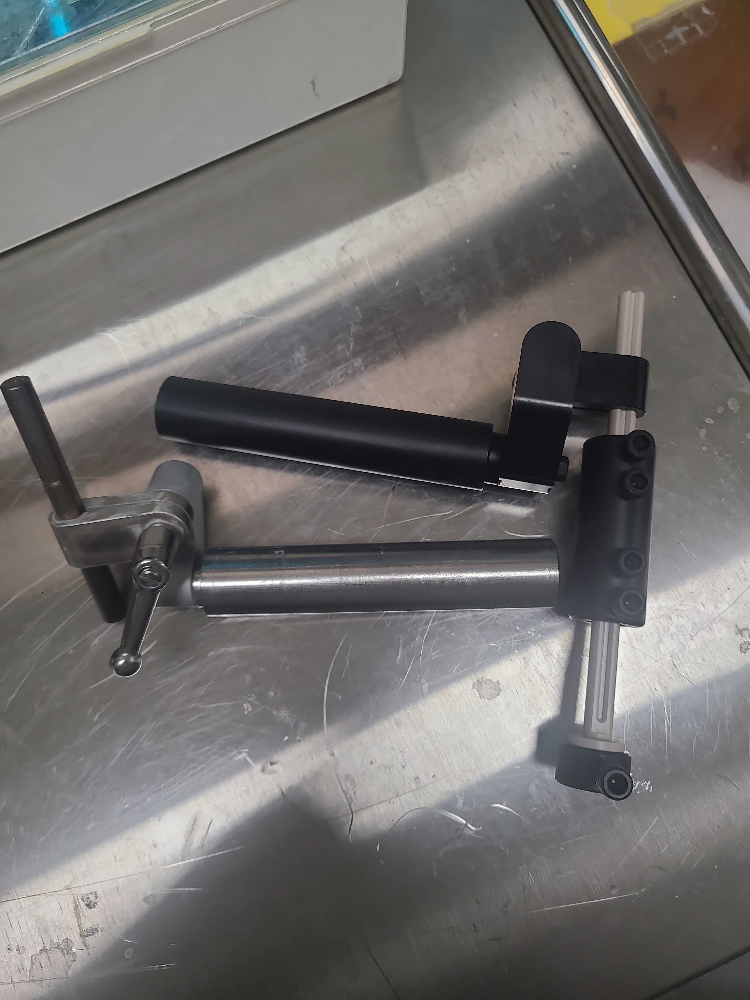
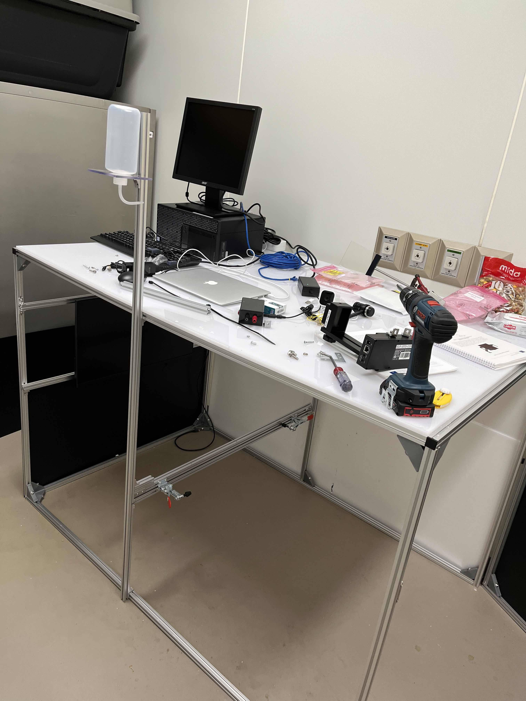
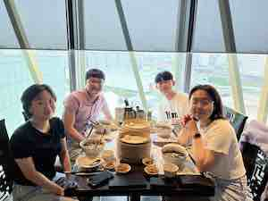
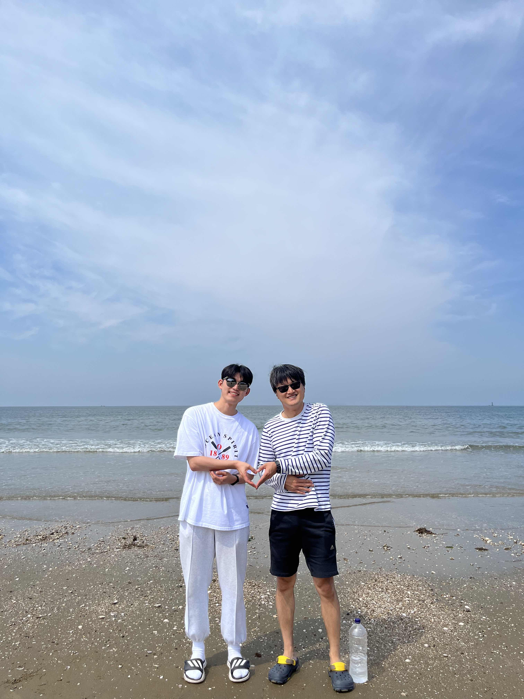
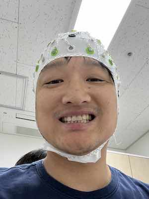
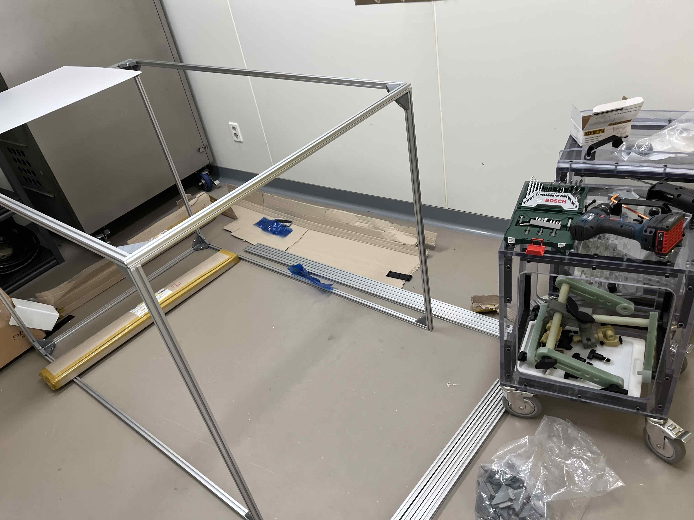
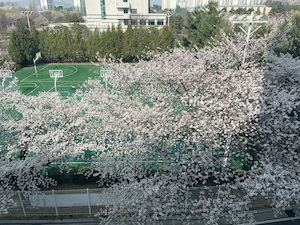
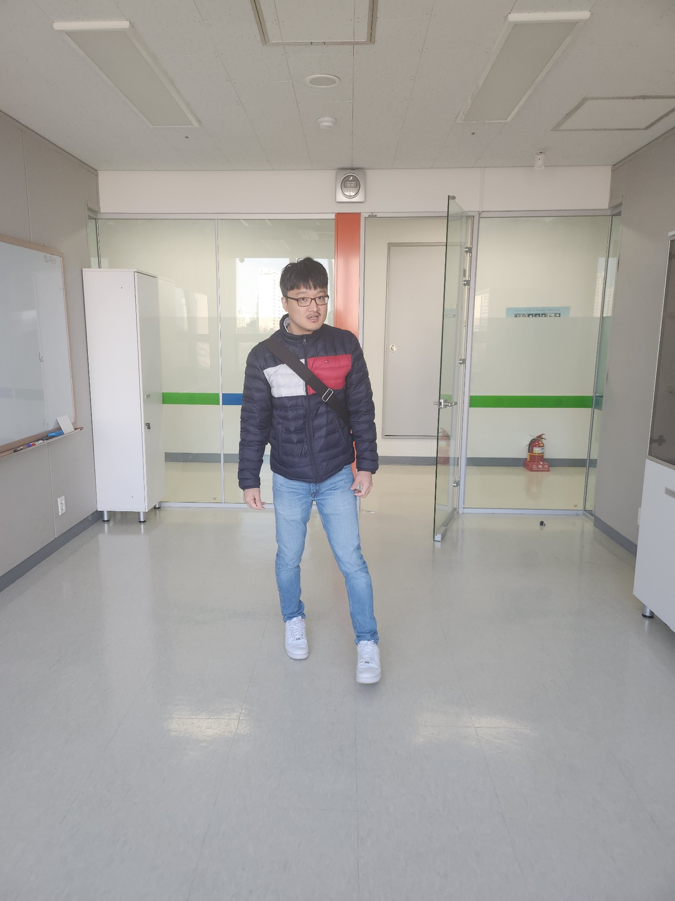



September 2023: Sujin Ahn joined NILab (n=5)! Welcome! And hansem gave a talk at Korean Soceity for Brain and Neural Sciences (KSBNS) where NILab also had fun!

September 2023 (month 7): We all go to MR-compatible world. Thanks, Min-jun for testing it out!  

August 2023 (month 6): Nahyun and Somang set up eye trackers!   

August 2023 (month 5): We devour dim-sum!  

June 2023 (month 4): Min-jun and Hansem went a joint retreat with Yoo lab & Hansem put himself into EEG-MRI.

June 2023: Nahyun Lee & Somang Paeng joined NILab (n=4)! Welcome! We can still fit in a car!

May 2023 (month 2): Min-jun and Hansem start from the scratch. 

May 2023: Min-jun Han joined NILab (n=2)! Welcome!

April 2023: Hansem gave a talk at Korean Human Brain Mapping (KHBM).

April 2023 (week 5): come to my office to see these cherry blossom!

March 2023: Hansem gave a talk at artificial vision seminar series in Korea Institue of Science and Technology (KIST).

March 2023 (week 3): checking equipments; can you tell what's missing in the right?

March 2023 (week 2): got two monitors!

February 2023 (week 1): 1st day in the office!

