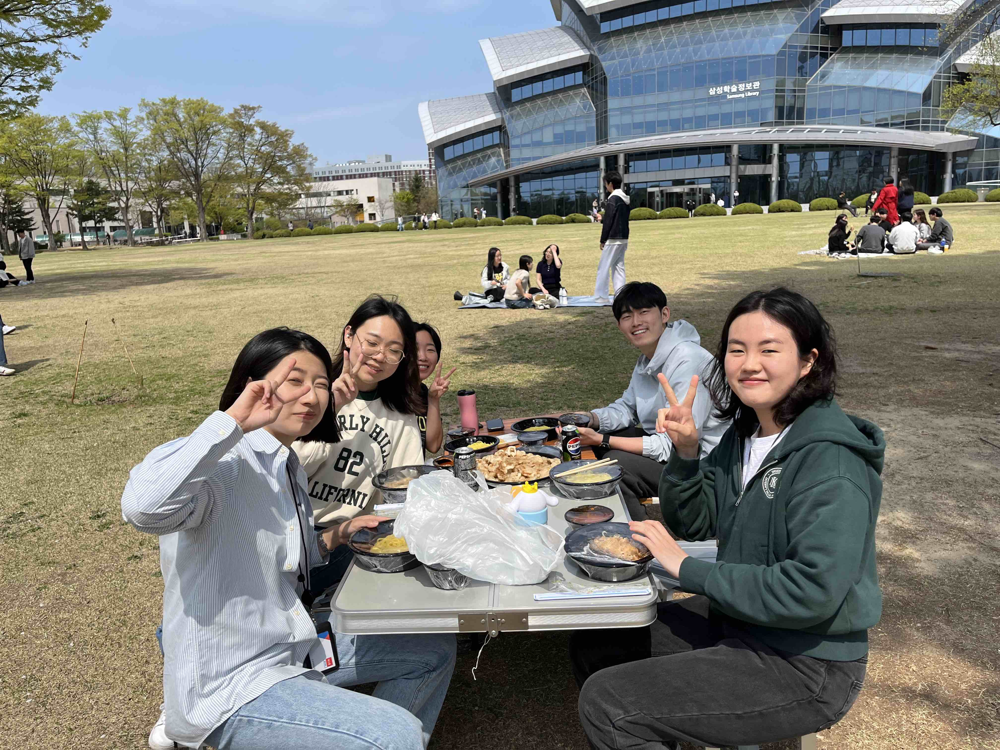
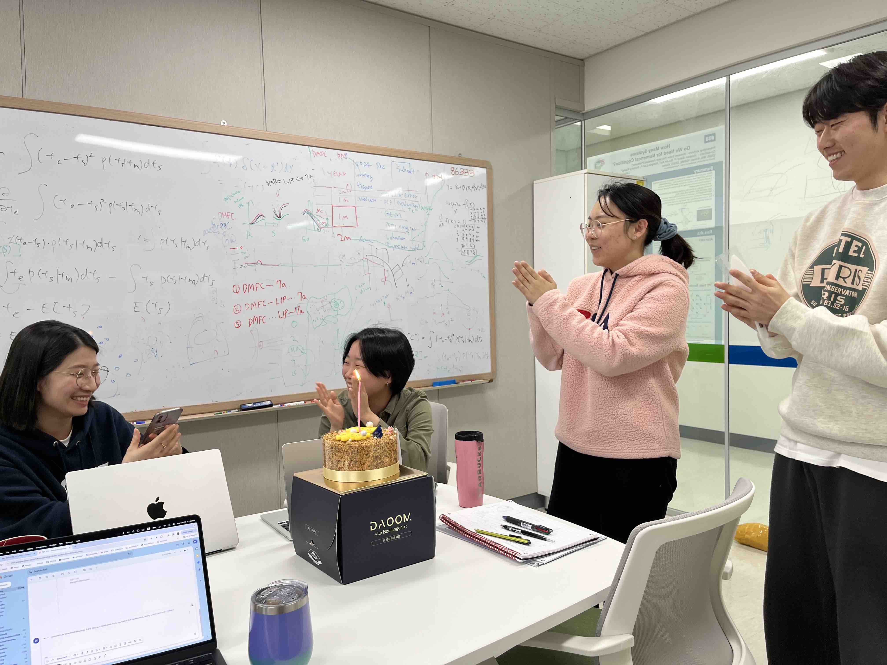



November 2025: linked but divided posters @ SFN

September 2025: fall semester opened with burger & fries

August 2025: NILAB rocks @ KSBNS & retreat

May 2025: Embarrassed Hansem at 5/15 event

April 2025: Min-jun’s paper got accepted

March 2025: start of spring semester!

January 2025: NILAB@CNIR event

December 2024: NILAB loves skiing

September 2024: Hansem gave a talk at KAIST

August 2024: NILAB is good at teaching each other

July 2024: Hansem inside scanner

June 2024: What do you see?

June 2024: Congrats! Dr. Han!

April 2024: Who's the best drill breaker?!

April 2024: NILab won!

April 2024: Good spring day!

March 2024: Creepy hansem!

February 2024: Birthday party for two people!

January 2024: Ski trip!

December 2023: End of year white board!

December 2023: End of year party!

November 2023: We got a first snow!

November 2023: We got a new chair!

September 2023: Sujin Ahn joined NILab (n=5)! Welcome! And hansem gave a talk at Korean Society for Brain and Neural Sciences (KSBNS) where NILab also had fun in Busan!

September 2023 (month 7): We all go to MR-compatible world. Thanks, Min-jun for testing it out!  

August 2023 (month 6): Nahyun and Somang set up eye trackers!   

August 2023 (month 5): We devour dim-sum!  

June 2023 (month 4): Min-jun and Hansem went a joint retreat with Yoo lab & Hansem put himself into EEG-MRI.

June 2023: Nahyun Lee & Somang Paeng joined NILab (n=4)! Welcome! We can still fit in a car!

May 2023 (month 2): Min-jun and Hansem start from the scratch. 

May 2023: Min-jun Han joined NILab (n=2)! Welcome!

April 2023: Hansem gave a talk at Korean Human Brain Mapping (KHBM).

April 2023 (week 5): come to my office to see these cherry blossom!

March 2023: Hansem gave a talk at artificial vision seminar series in Korea Institue of Science and Technology (KIST).

March 2023 (week 3): checking equipments; can you tell what's missing in the right?

March 2023 (week 2): got two monitors!

February 2023 (week 1): 1st day in the office!

