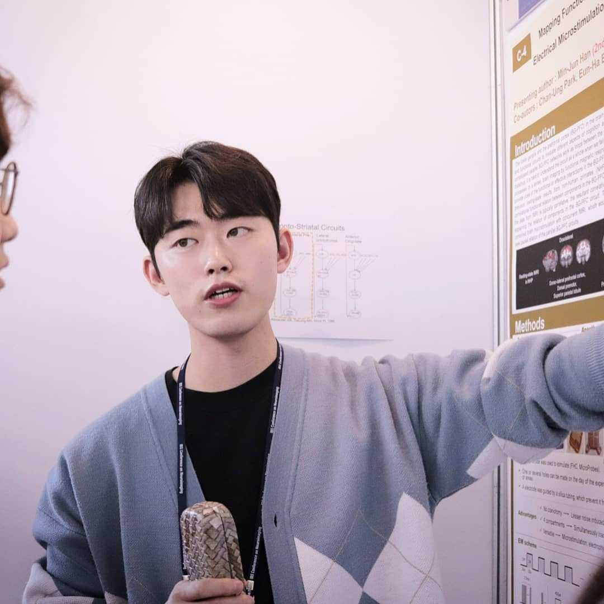
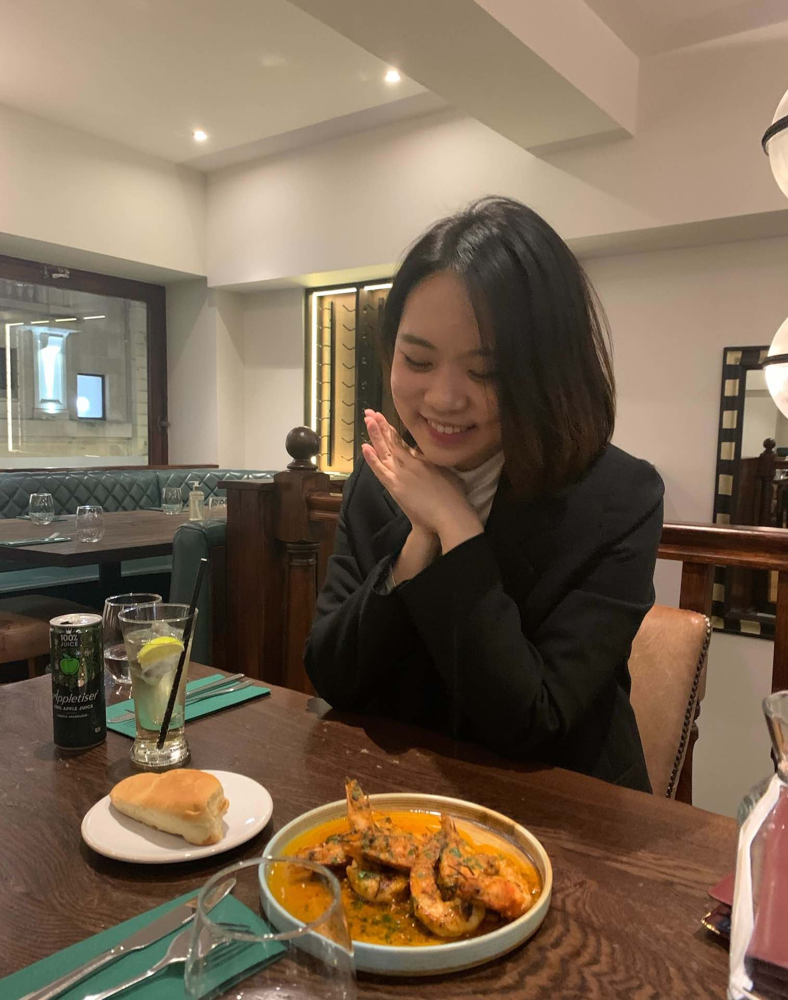



### [Hansem Sohn: PI](https://hansem.github.io/)
_Geek & Dad (alledgely INFP)_

### Min-jun Han
_Ph.D. candidate & a.k.a CNIR insider/인싸 (INFJ)_

### Nahyun Lee
_Master's student & Endless wonderer & Professional foodie (ENTP)_

### Somang Paeng
_Post-master researcher_

### Su-jin Ahn
_Post-master researcher_

### YOU
  * see [job ad](https://natural-intelligence-lab.github.io/join)

> The lab is committed to promote diversity and inclusive environment!

