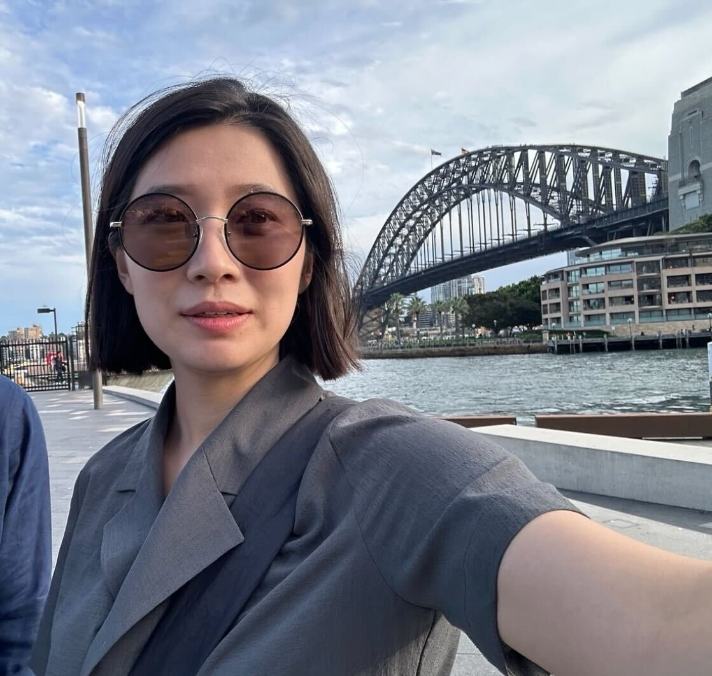
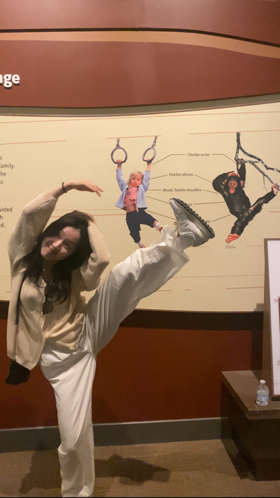
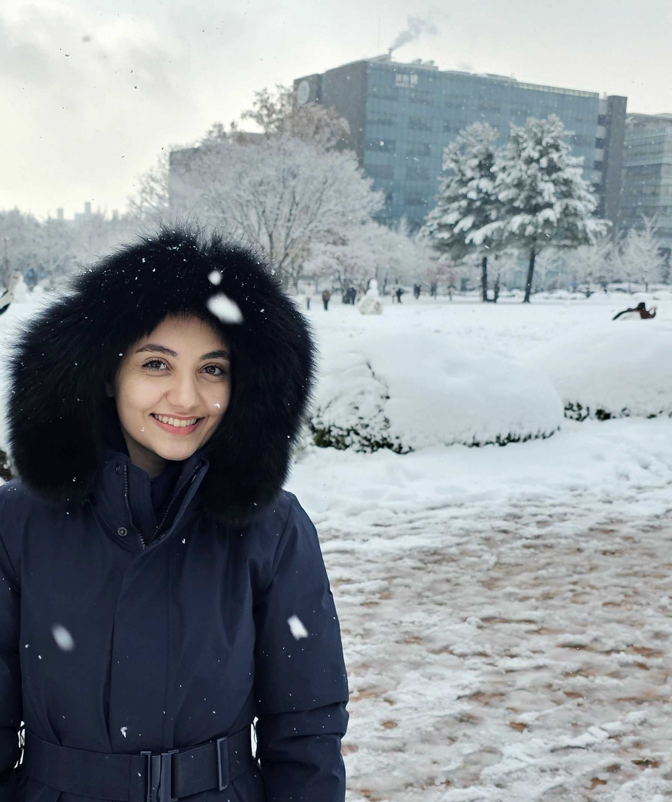
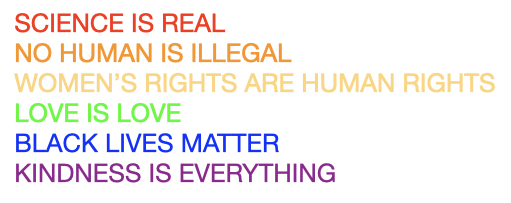



### [Hansem Sohn: PI](https://hansem.github.io/)
_Geek & Dad (alledgely INFP)_

### Ph.D. student
_Su-Jin An_

[google scholar](https://scholar.google.com/citations?user=7HxZ53MAAAAJ&hl=en&oi=ao)

_Somang Paeng_

[google scholar](https://scholar.google.ca/citations?user=McgwgyMAAAAJ&hl=en&oi=ao)

### Post-master researcher
_Shin-Young An_

[paper](https://www.sciencedirect.com/science/article/pii/S030100822400087X)

### Master student
_Joohyun Lee_

_Jimin Lee_

_Arghavan Bazigaran_

### Undergraduate student
_Yelyn Lee_

_Seongha Choi_

_Hyujun Gu_

### Admin
_Joohee Oh_

### Alumni
_Min-jun Han_

_Nahyun Lee_

### YOU
  * see [job ad](https://natural-intelligence-lab.github.io/join)

> The lab is committed to promote diversity and inclusive environment!

