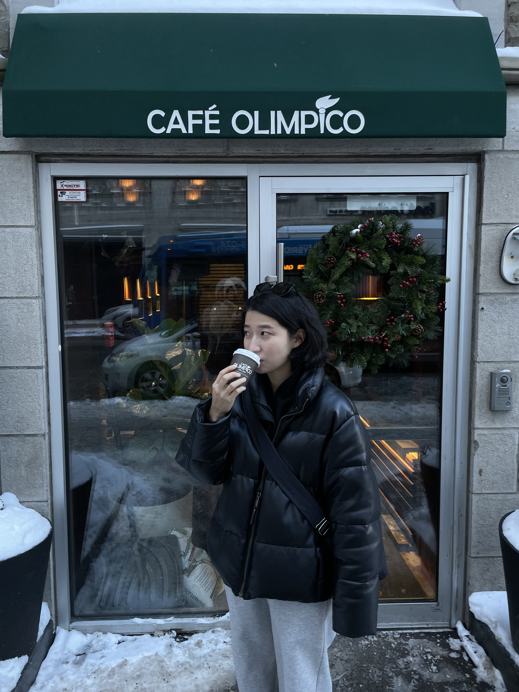
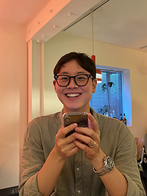
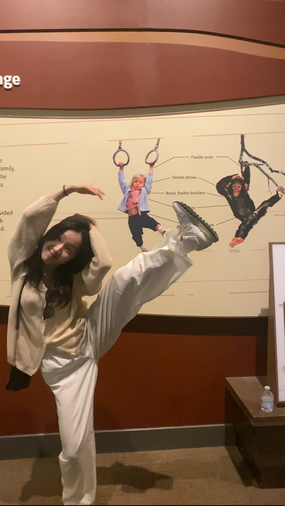



  <!-- PI -->
  

    

      
      
HS

      Principal Investigator
      
Hansem Sohn

      
Geek &amp; Dad (allegedly INFP)

      <a class="person-link" href="https://hansem.github.io/" target="_blank" rel="noopener">hansem.github.io ↗</a>
    

  

  <!-- PhD Students -->
  <section class="people-section">
    <h2 class="people-section-title">Ph.D. students</h2>
    

      

        
        
SA

        
Su-Jin An

        <a class="person-link" href="https://scholar.google.com/citations?user=7HxZ53MAAAAJ&hl=en&oi=ao" target="_blank" rel="noopener">Google Scholar ↗</a>
      

      

        
        
SP

        
Somang Paeng

        <a class="person-link" href="https://scholar.google.ca/citations?user=McgwgyMAAAAJ&hl=en&oi=ao" target="_blank" rel="noopener">Google Scholar ↗</a>
      

      

        
        
JH

        
Jun Seo Hwang

      

    

  </section>

  <!-- Post-master -->
  <section class="people-section">
    <h2 class="people-section-title">Post-master researcher</h2>
    

      

        
        
SY

        
Shin-Young An

        <a class="person-link" href="https://www.sciencedirect.com/science/article/pii/S030100822400087X" target="_blank" rel="noopener">Paper ↗</a>
      

    

  </section>

  <!-- Master Students -->
  <section class="people-section">
    <h2 class="people-section-title">Master students</h2>
    

      

        
        
JL

        
Joohyun Lee

      

      

        
        
JL

        
Jimin Lee

      

      

        
        
AB

        
Arghavan Bazigaran

      

    

  </section>

  <!-- Undergrads -->
  <section class="people-section">
    <h2 class="people-section-title">Undergraduate students</h2>
    

      Yelyn Lee
      Seongha Choi
      Hyujun Gu
    

  </section>

  <!-- Admin -->
  <section class="people-section">
    <h2 class="people-section-title">Admin</h2>
    

      Joohee Oh
    

  </section>

  <!-- Alumni -->
  <section class="people-section">
    <h2 class="people-section-title">Alumni</h2>
    

      Min-jun Han
      Nahyun Lee
    

  </section>

  <!-- Join -->
  <section class="people-join">
    
Interested in joining?

    
The lab is committed to diversity and an inclusive environment.

    <a class="people-join-link" href="https://natural-intelligence-lab.github.io/join" target="_blank" rel="noopener">See open positions ↗</a>
  </section>

