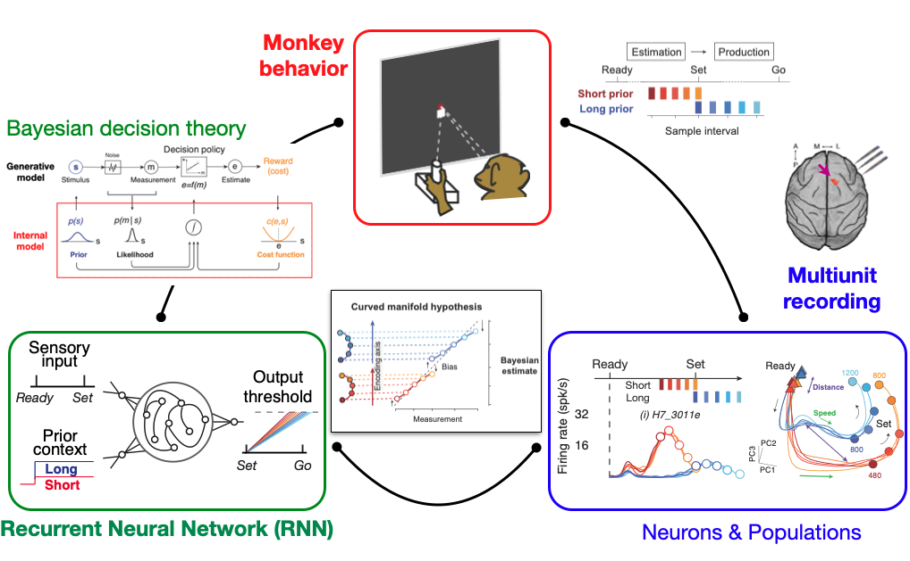
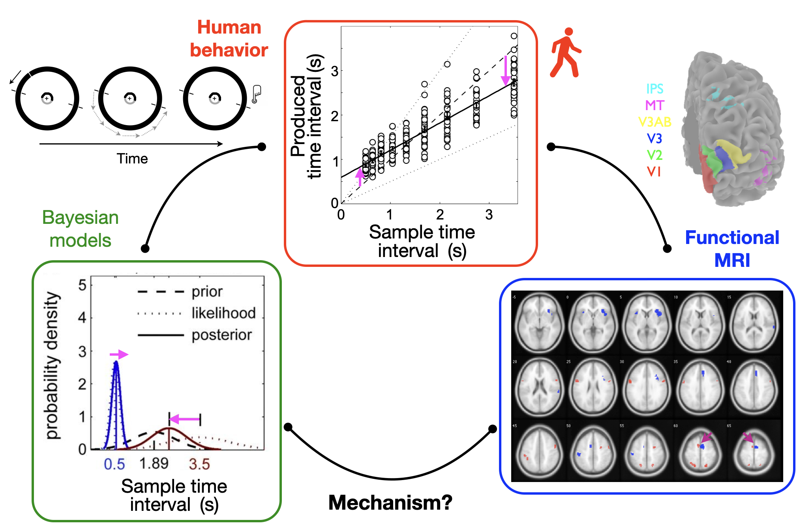



## Integrative approach to study principles of natural intelligence
* It is not easy to _understand_ natural intelligence. So we take multidisciplinary approach - cognitive computational neuroscience - including careful design of cool tasks, observing behaviors from both humans and non-human primates, collecting neural data with functional neuroimaging and electrophysiology, testing predictions from computational theories and models, and comparing artificial neural networks to biological data. Of course, this is going to be a daunting task, which is exactly why we need teamwork and collaborations!

## Project 1. Numerical cognition and compositionality
* In this project, we will tackle the following questions:
  * How does the brain represent ecologically relevant numerical information (e.g., number of apples) and perform computations based on those representations (compositionality)?
  * Is there a neural circuit dedicated to numerical information processing? Is it common across different modalities of quantities - number, time, and space?
  * What is the role of the prefrontal and posterior parietal cortex in processing numerical information? Are they rather independent modules or parts of a big recurrent network?
  * Do humans and non-human primates share similar neural mechanisms for magnitude processing?

## Project 2. Neural basis of relational inference in posterior parietal cortex
How does the brain make inferences based on relations between objects? To tackle this question, we have collected electrophysiology data from the posterior parietal cortex while animals performed a visual search task based on object relations in collaboration with Dr. Mehrdad Jazayeri at MIT. The large-scale neural data and its dynamical-systems analysis, will shed light on how the cortical population dynamics unfold during the relational inference. We also train artificial (graph) neural networks on the relational reasoning task and “open up” to examine how similar or different biological and artificial networks are during the task. Ultimately, this project will provide an opportunity to reverse engineer natural intelligence for neuro-AI applications.

Extended data figure 9 from Lyu, Abbott & Maimon (2022) Nature 

## Previous project 1. Bayesian computation through cortical latent dynamics (NHP electrophysiology)
  * _Postdoc in [Mehrdad Jazayeri's lab](https://jazlab.org/) at MIT, May 2015 - February 2023_
  * _Postdoc in [Daeyeol Lee's lab](https://sites.krieger.jhu.edu/daeyeol-lee-lab/) at Yale, April 2013 - April 2015_

**Research questions**
* What is the neural mechanism behind behavioral biases in interval timing? (answer: curved neural manifold)
* Is there a common principle behind the bias generation between biological and artificial neural networks? (answer: yes, we observed curved manifold in both networks)
* How does the brain process multiple events that occur concurrently in time? (answer: we don’t know yet)

**Publications**
* Sohn H^, Narain D^, Meirhaeghe N^, Jazayeri M (2019) Bayesian computation through cortical latent dynamics. Neuron 103(5):934-947. PMID31320220 (^Equal Contribution).
    * highlighted in [brain inspired podcast](https://braininspired.co/podcast/113/)
    * selected as the best talk in Motor Learning and Motor Control, Official satellite meeting of
the Society for Neuroscience (2018)
* Sohn H, Jazayeri M (2021) Validating model-based Bayesian integration using prior-cost metamers. Proc Natl Acad Sci U S A 118 (25): e2021531118. PMID34161261
* Sohn H^, Meirhaeghe N^, Rajalingham R, Jazayeri M (2020) A network perspective on sensorimotor learning. Trends in Neuroscience 44(3):170-181. PMID33349476 (^Equal Contribution).
* Sohn H, Narain D (2021) Neural implementations of Bayesian computation. Current Opinion in Neurobiology 70:121-129. PMID34678599
* Meirhaeghe N, Sohn H, Jazayeri M (2021) A precise and adaptive neural mechanism for predictive temporal processing in the frontal cortex. Neuron. 109(18):2995-3011.e5. PMID34534456
* Kleinman MR, Sohn H, Lee D (2016) A two-stage model for concurrent interval timing in monkeys. J Neurophysiol 116(3):1068-1081. PMID27334954.
* Beiran M^, Meirhaeghe N^, Sohn H, Jazayeri M, Ostojic S (2023) Parametric control of flexible timing through low-dimensional neural manifolds. Neuron. S0896-6273(22)01089-3. PMID 36640766 (^Equal Contribution)
* Keshtkaran MR^, Sedler AR^, Chowdhury RH, Tandon R, Basrai D, Nguyen SL, Sohn H, Mehrdad M, Miller LE, Pandarinath C (2022) A large-scale neural network training framework for generalized estimation of single-trial population dynamics. Nature Methods. 19: 1572-1577 PMID 36443486 (^Equal Contribution)

## Previous project 2. Bayesian interval timing in human behavior & neuroimaging
>_Ph.D. in [Sang-hun Lee’s lab](https://www.snu-csnl.com/) at Seoul National University, March 2008 - March 2013_

* Many of our behaviors exhibit biases and rely on heuristics built through prior experiences. This process has been formalized by Bayesian decision theory, which has been quite successful in explaining behaviors across many different domains. One of the domains where the behavioral biases express prominently is timing and time perception, partly owing to its high measurement noises. After being trained in visual neuroscience (e.g., studying binocular rivalry), I performed human psychophysics experiments to study long-term learning of the interval timing and applied a Bayesian modeling approach to reveal underlying computational principles. I also collected human functional MRI data while subjects are performing the interval-timing task.

**Publications**
* Sohn H, Lee SH (2013) Dichotomy in perceptual learning of interval timing: calibrations of mean accuracy and precision differ in specificity and time course. J Neurophysiol 109:344-362. PMID23076112
* Brascamp JW, Sohn H, Lee SH, Blake R (2013) A monocular contribution to stimulus rivalry. Proc Natl Acad Sci U S A 110(21): 8337-8344. PMID23610414

## Previous project 3. Neuroeconomic approach to temporal discounting of monetary gain and loss
>_M.S. in [Jaeseung Jeong’s lab](http://raphe.kaist.ac.kr/) at KAIST, March 2006 - February 2008_

* I performed human fMRI experiments to study how the brain processes monetary gains and losses given at different time points.
* I collaborated with clinicians to analyze EEGs of patients with neurological and psychiatric disorders using information theory and nonlinear dynamics.

**Publications**
* Sohn H^, Kim I^, Lee W, Peterson BS, Hong H, Chae J, Hong S, Jeong J (2010) Linear and non-linear EEG analysis of adolescents with attention-deficit/hyperactivity disorder during a cognitive task. Clin Neurophysiol 121:1863-1870 (Cover Article; ^Equal Contribution). PMID20659814
* Sohn H, Kim S (2006) Simple reinforcement learning models are not always appropriate. J Neurosci 26:11511-11512 (Journal Club). PMID17106946
* Hong H^, Sohn H^, Cha M, Kim S, Oh J, Chu MK, Namkoong K, Jeong J (2012) Increased frontomotor oscillations during tic suppression in children with Tourette syndrome. J Child Neurol (published online before print; ^Equal Contribution). PMID22859696
* Kim YT, Sohn H, Jeong J (2011) Delayed transition from ambiguous to risky decision-making in alcohol dependence during Iowa gambling task. Psychiat Res 190:297-303. PMID21676471
